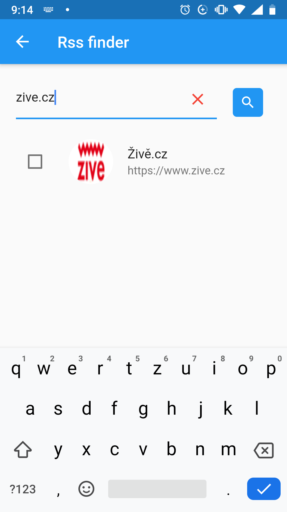
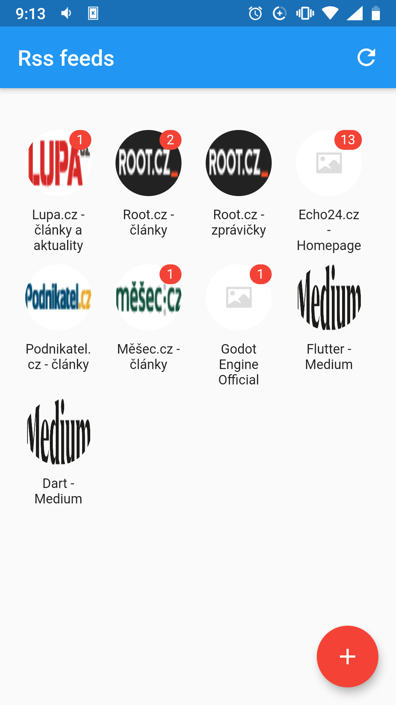

# RSS Reader
Flutter application for download and read RSS articles


## Installation

  ```
  git clone https://github.com/mjablecnik/rss_reader
  cd rss_reader
  flutter pub get
  ```
  
## Features
 - Find new RSS sources
 - Add/Remove RSS source
 - Download latest articles
 - Listing and sorting articles
 - Show article preview
 - Read article in app
 - Set article as read
 - Delete old articles


## Special thanks

 - [Dart](https://dart.dev/): Client-optimized language for fast apps on any platform.
 - [Flutter](https://flutter.dev/): UI toolkit for building beautiful, natively compiled applications for mobile, web, and desktop from a single codebase.
 - [Riverpod](https://riverpod.dev/): State manager for Flutter.
 - [Hive](https://hivedb.dev/): Lightweight and blazing fast key-value database inspired by Bitcask.


## Screenshots
<table>
 <tr><td>
   
 </td><td>
   
 </td></tr>
 <tr><td>
   
 </td><td>
   
 </td></tr>
</table>


## Contributing
Pull requests are welcome. For major changes, please open an issue first to discuss what you would like to change.


## Author

👤 **Martin Jablečník**

* Website: [martin-jablecnik.cz](https://www.martin-jablecnik.cz)
* Github: [@mjablecnik](https://github.com/mjablecnik)


## Show your support

Give a ⭐️ if this project helped you!

<a href="https://www.patreon.com/mjablecnik">
  
</a>


## 📝 License

Copyright © 2021 [Martin Jablečník](https://github.com/mjablecnik).<br />
This project is [GNU GPLv3](https://choosealicense.com/licenses/gpl-3.0/) licensed.


